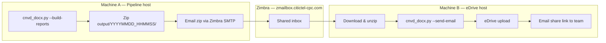

# Proposal: Zimbra-Mediated Report Transfer for eDrive Upload

## Summary

The CNVD report pipeline generates weekly DOCX and XLSX outputs on a development machine that **cannot reach the corporate eDrive network**. A second machine on the eDrive network can upload files, but the two machines **cannot communicate directly** (no SSH, no shared LAN path).

This proposal adopts **Zimbra corporate email** ([zmailbox.citictel-cpc.com](https://zmailbox.citictel-cpc.com/)) as a transfer bridge. Both machines can access the same Zimbra account. Machine A emails the report bundle; Machine B downloads it, uploads to eDrive, and sends the final share link to recipients.

No new infrastructure (message queues, personal cloud storage, or VPN changes) is required.

---

## Background

The `pipeline_docx` project automates weekly vulnerability reporting:

1. Match CNVD/CNNVD records against software clusters.
2. Search and extract evidence with AI.
3. Generate Chinese and English Word reports and an Excel disclosure sheet.
4. Upload the timestamped output folder to **AnyShare eDrive**.
5. Email recipients an **eDrive share link** (not file attachments).

Each run writes files under a timestamped folder, for example:

```
output/20260706_173000/
  2026.06.30-07.06_周報.docx
  2026.06.30-07.06_周報_en.docx
  2026.06.30-07.06_本周重要漏洞实例情况.xlsx
```

Upload is performed by the local `edrive` Python client against `EDRIVE_BASE_URL` (e.g. `https://edrive.citictel-cpc.com`).

---

## Problem

| Machine | Role | Network access |
|---------|------|----------------|
| **Machine A** (pipeline host) | Report generation (MongoDB, SearXNG/Firecrawl, llama-server) | Cannot reach eDrive API |
| **Machine B** (upload host) | eDrive upload and outbound report email | Can reach eDrive API |

**Constraints identified:**

- Machine A and Machine B **cannot SSH** to each other.
- Direct copy methods (rsync, scp) are not available without network connectivity.
- Personal cloud drives (Google Drive, Dropbox) may be blocked or undesirable for confidential reports.
- Message brokers (RabbitMQ, Redis, SQS) add operational overhead and still require a separate file-transfer channel.

**Goal:** Move the generated `output/<run_folder>/` from Machine A to Machine B reliably, then complete eDrive upload and recipient email on Machine B.

---

## Options Considered

| Option | Verdict |
|--------|---------|
| Run full pipeline on Machine B | Rejected — B may lack MongoDB, AI, and search dependencies |
| rsync / scp between A and B | Rejected — no direct network path |
| Personal cloud (Google Drive, OneDrive) | Rejected — policy risk; not guaranteed on both machines |
| RabbitMQ / job queue + object storage | Rejected — over-engineered for weekly single-folder transfer |
| Syncthing (P2P) | Rejected — unreliable across corporate firewalls |
| **Zimbra shared mailbox** | **Selected** — both machines already have access; company-approved |

---

## Proposed Solution

Use the **shared Zimbra account** as an internal drop box:

1. **Machine A** builds reports and emails a zip of the run folder to the shared inbox.
2. **Machine B** downloads the zip from Zimbra, unpacks it, and runs the existing upload-and-email command.
3. **Machine B** uploads to eDrive and sends the weekly report email with the share link to `EMAIL_RECEIVER`.



### Two distinct email purposes

| Email | From | To | Content |
|-------|------|-----|---------|
| **Transfer email** (bridge) | Machine A | Shared Zimbra account | Zip attachment; subject `PIPELINE_UPLOAD:YYYYMMDD_HHMMSS` |
| **Report email** (delivery) | Machine B | `EMAIL_RECEIVER` | eDrive share link in body (existing pipeline behaviour) |

---

## Operational Workflow

### Machine A — Generate and send

```bash
cd /path/to/pipeline_docx
.venv/bin/python cnvd_docx.py --config config.json --build-reports
```

Note the output folder name from the log (e.g. `output/20260706_173000`).

```bash
FOLDER=20260706_173000
zip -r "${FOLDER}.zip" "output/${FOLDER}"
```

Send `${FOLDER}.zip` to the shared Zimbra mailbox:

- **Web:** Log in at [zmailbox.citictel-cpc.com](https://zmailbox.citictel-cpc.com/), compose, attach zip, send to the same account.
- **SMTP (optional automation):** Use company SMTP settings from `.env` to script the send.

Recommended subject line: `PIPELINE_UPLOAD:20260706_173000`

### Machine B — Download, upload, and deliver

1. Open the shared Zimbra inbox and download the zip for the latest `PIPELINE_UPLOAD:*` message.
2. Unzip to a local path, e.g. `~/pipeline_docx/output/20260706_173000/`.
3. Run:

```bash
cd /path/to/pipeline_docx
.venv/bin/python cnvd_docx.py --config config.json --send-email 20260706_173000
```

This uploads the folder to eDrive and emails the share link to recipients.

---

## Configuration Split

Credentials should be split by machine responsibility.

### Machine A `.env`

| Variable | Required |
|----------|----------|
| `FIRECRAWL_API_KEY` | Yes (if using Firecrawl / fallback) |
| `ZIMBRA_EMAIL`, `ZIMBRA_PASSWORD`, `ZIMBRA_HOST` | Yes (transfer zip and notification SMTP) |
| `EDRIVE_*` | **No** — upload happens on B |

### Machine B `.env`

| Variable | Required |
|----------|----------|
| `EDRIVE_USERNAME`, `EDRIVE_PASSWORD`, `EDRIVE_REMOTE_PATH`, `EDRIVE_BASE_URL` | Yes |
| `EMAIL_RECEIVER`, `ZIMBRA_EMAIL`, `ZIMBRA_PASSWORD`, `ZIMBRA_HOST` | Yes (final report email via Zimbra SMTP) |
| `FIRECRAWL_API_KEY` | No |

Machine A does not need eDrive credentials. Machine B does not need search or AI keys unless reports are also generated there.

---

## Security and Compliance

- Reports may contain sensitive vulnerability information — Zimbra is **corporate mail**, which is preferable to personal cloud storage.
- Do **not** include `.env` files or passwords in the transfer zip.
- Use a **private** shared account; avoid public “anyone with link” sharing.
- Confirm Zimbra **attachment size limits** with IT (typically 10–50 MB; weekly report zips are expected to be well within this).
- Delete processed transfer emails or zips from the inbox after successful upload if retention policy requires it.

---

## Risks and Mitigations

| Risk | Mitigation |
|------|------------|
| Attachment too large for Zimbra | Zip only the run folder; confirm limit with IT |
| Wrong folder uploaded | Use `PIPELINE_UPLOAD:<folder_name>` subject convention |
| Duplicate processing on B | Process only the latest unhandled message; move or delete after success |
| Manual steps forgotten | Weekly checklist (below); future automation via SMTP/IMAP scripts |
| eDrive upload fails on B | Existing pipeline logs errors; retry `--send-email` after fixing credentials |

---

## Weekly Checklist

- [ ] **A:** Run `--build-reports`; confirm output folder name
- [ ] **A:** Zip `output/<folder>/` and email to shared Zimbra (`PIPELINE_UPLOAD:<folder>`)
- [ ] **B:** Download zip from Zimbra and unzip
- [ ] **B:** Run `--send-email <folder>`
- [ ] **B:** Confirm eDrive share link received by `EMAIL_RECEIVER`
- [ ] **Both:** Archive or delete transfer email if required by policy

---

## Future Enhancements (Optional)

These are not required for the initial rollout but would reduce manual steps:

1. **Script on A** — After `--build-reports`, auto-zip and send via SMTP with subject `PIPELINE_UPLOAD:*`.
2. **Script on B** — Poll Zimbra IMAP for `PIPELINE_UPLOAD:*`, download attachment, unzip, and invoke `--send-email`.
3. **`--skip-edrive-upload` flag on A** — Explicitly skip upload during `--build-reports` when eDrive is not configured on A.

---

## Conclusion

The pipeline’s report generation and eDrive delivery are split across two machines with no direct network path. **Zimbra shared email** is the simplest company-approved bridge: both machines already have access, no new services are needed, and the existing `cnvd_docx.py --send-email` command on Machine B completes upload and delivery unchanged.

**Decision:** Adopt Zimbra-mediated transfer as the standard weekly workflow until direct connectivity or a dedicated shared storage path becomes available.
